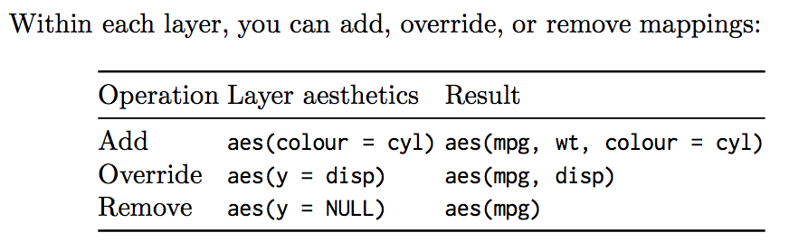
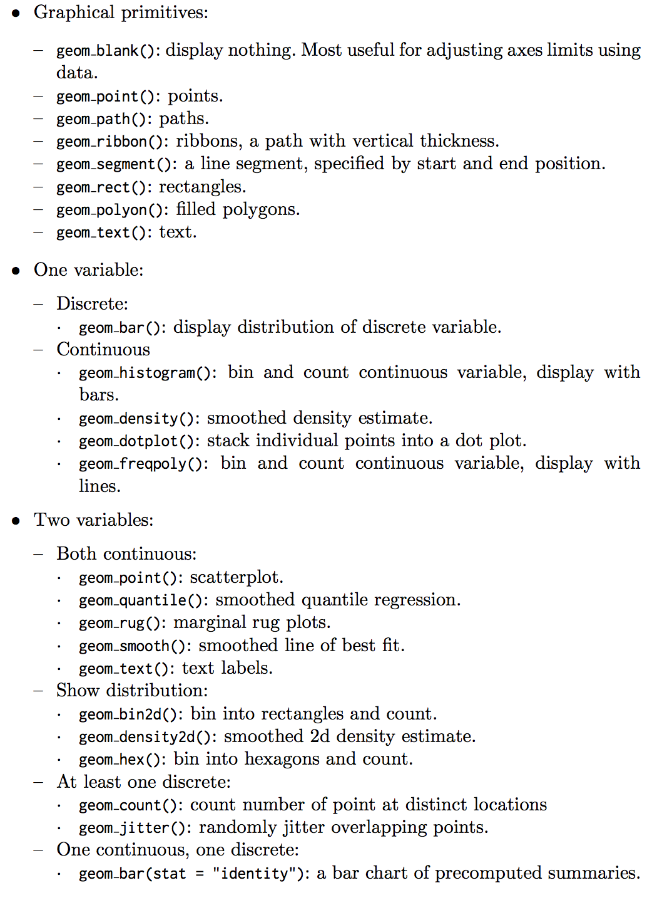
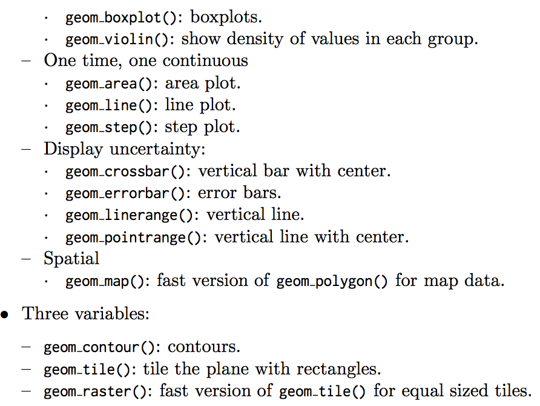
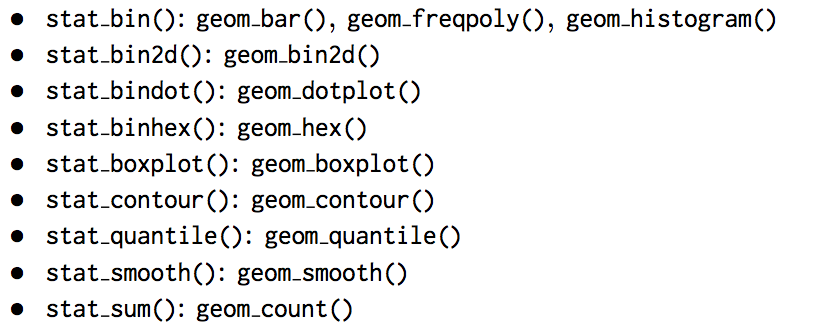
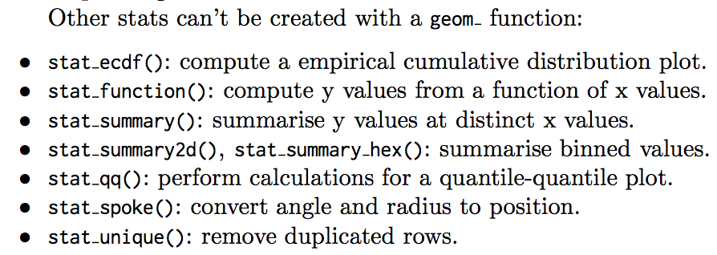

## Chapter 4 Mastering the grammar  
### 4.1 Introduction  
### 4.2 Building a scatterplot  
```{r}
library(ggplot2)
ggplot(mpg,aes(displ,hwy,color = factor(cyl)))+
  geom_point()
```  
#### 4.2.1 Mapping aesthetics to data  
A scatterplot represents each observation as a point, positioned according to the value of two variables.  
These attributes are called _aesthetics_, and are the properties that can be perceived on the graphic.  


The scatterplot uses points, but were we instead to draw lines we would get a line plot. If we used bars, we’d get a bar plot.  
```{r}
ggplot(mpg, aes(displ, hwy, colour = factor(cyl))) +
  geom_line() +
  theme(legend.position = "none")
ggplot(mpg, aes(displ, hwy, colour = factor(cyl))) +
  geom_bar(stat = "identity", position = "identity", fill = NA) +
  theme(legend.position = "none")
```  
Points, lines and bars are all examples of geometric objects, or _geoms_. Geoms determine the “type” of the plot. Plots that use a single geom are often given a special name.  
```{r}
ggplot(mpg, aes(displ, hwy, colour = factor(cyl))) +
  geom_point() +
  geom_smooth(method = "lm")
```  

#### 4.2.2 Scaling  
Unify units: _scaling_  
the drawing system that ggplot2 uses, _grid_, takes care of mapping from the range of data to [0,1] for us. A final step determines how the two positions (x and y) are combined to form the final location on the plot. This is done by the
coordinate system, or _coord_.  

Before:  
  

After:   
  

### 4.3 Adding complexity  
```{r}
ggplot(mpg, aes(displ, hwy)) +
  geom_point() +
  geom_smooth() +
  facet_wrap(~year)
```  
each facet panel in each layer has its own dataset.  
The smooth layer is different to the point layer because it doesn’t display the raw data, but instead displays a statistical transformation of the data.  
The data is passed to a statistical transformation, or _stat_, which manipulates the data in some useful way.  

* Scale transformation occurs before statistical transformation so that statistics are computed on the scale-transformed data.  

* Each scale is trained on every dataset from all the layers and facets.  

* The scales map the data values into aesthetic value  

### 4.4 Components of the layer grammar  


#### 4.4.1 Layers  
_layers_ are responsible for creating the objects that we perceive on the plot.  
1: data and aesthetic mapping  
2: a statistical transformation (stat)  
3: a geometric object (geom)  
4: a position adjustment  

#### 4.4.2 Scales  
#### 4.4.3 Coordinate system  
A coordinate system, or coord for short, maps the position of objects onto the plane of the plot.  

#### 4.4.5 Faceting  


## Chapter 5 Build a plot layer by layer  
### 5.1 Introduction  
### 5.2 Building a plot  
First we create a plot with default dataset and aesthetic mappings:
```{r}
p <- ggplot(mpg, aes(displ, hwy))
p

p+ geom_point()
```

geom_point() is a shortcut. Behind the scenes it calls the layer() function to create a new layer:  
```{r}
p + layer( 
  mapping = NULL,
  data = NULL,
  geom = "point", 
  #geom_params = list(),
  stat = "identity", 
  #stat_params = list(),
  position = "identity"
)
```  
* mapping: using `aes()` function. if NULL, default is used  
* data: usually set as NULL, default used.  
* geom: name of the geometric object to use to draw each observation.  
* Stat: The name of the statistiucal transformation to use. identity keep the data as is.  
* position: adjusting overlapping objects, like jittering, stacking or dodging.  

### 5.3 Data  
The data on each layer doesn't need to be the same.  
fit a loess model and generate predictions from it.  

```{r}
mod <- loess(hwy ~ displ, data = mpg)
grid <- data.frame(displ = seq(min(mpg$displ),max(mpg$displ), length = 50))
grid$hwy <- predict(mod, newdata = grid)
grid
```  

isolate observations that are particularly far away from their predicted values.  
```{r}
mpg=mpg
std_resid <- resid(mod) / mod$s
outlier <- mpg[abs(std_resid) > 2,]
outlier
```  
Plot with two dataset:  

```{r}
ggplot(mpg, aes(displ, hwy)) +
  geom_point() +
  geom_line(data = grid, colour = "blue", size = 1.5) +
  geom_text(data = outlier, aes(label = model))
```  

You need the explicit `data =` in the layers.  

Less clear method:  

```{r}
ggplot(mapping = aes(displ, hwy)) + 
  geom_point(data = mpg) +
  geom_line(data = grid) +
  geom_text(data = outlier, aes(label = model))
```  

### 5.4 Aesthetic Mappings  

`aes()` describe how variables are mapped to visual properties or _aesthetics_. Never refer to a variable with $ in `aes()`.  

#### 5.4.1 Specifying the Aesthetics in the Plot vs. in the Layers.  
Same plots:  
```{r}
ggplot(mpg, aes(displ, hwy, colour = class)) + geom_point()
ggplot(mpg, aes(displ, hwy)) + geom_point(aes(colour = class))
ggplot(mpg, aes(displ)) + geom_point(aes(y = hwy, colour = class))
ggplot(mpg) + geom_point(aes(displ, hwy, colour = class))
```  
  

The distinction is important when you start adding additional layers.  
```{r}
ggplot(mpg, aes(displ, hwy, colour = class)) + 
  geom_point() +
  geom_smooth(method = "lm", se = FALSE) + 
  theme(legend.position = "none")


ggplot(mpg, aes(displ, hwy)) + 
  geom_point(aes(colour = class)) + 
  geom_smooth(method = "lm", se = FALSE) + 
  theme(legend.position = "none")
```  
Generally, you wnat to set up the mappings to illuminate the structure underlying the graphic and minimize typing.  

#### 5.4.2 Setting vs. Mapping  
If you want appearance to be governed by a variable, put the specification inside aes(); if you want override the default size or colour, put the value outside of aes().
```{r}
ggplot(mpg, aes(cty, hwy)) + geom_point(colour = "darkblue")
ggplot(mpg, aes(cty, hwy)) + geom_point(aes(colour = "darkblue"))
```

The second plot maps (not sets) the colour to the value ‘darkblue’. This effectively creates a new variable containing only the value ‘darkblue’ and then scales it with a colour scale.  

A third approach is to map the value, but override the default scale:  
```{r}
ggplot(mpg, aes(cty, hwy)) + 
  geom_point(aes(colour = "darkblue")) + 
  scale_colour_identity()
```  

if you want to display multiple layers with varying parameters, you can “name” each layer:  
```{r}
ggplot(mpg, aes(displ, hwy)) + 
  geom_point() +
  geom_smooth(aes(colour = "loess"), method = "loess", se = FALSE) +
  geom_smooth(aes(colour = "lm"), method = "lm", se = FALSE) +
  labs(colour = "Method")
```  

### 5.5 Geoms  



### 5.6 Stats  





```{r}
ggplot(mpg, aes(trans, cty)) +
  geom_point() +
  stat_summary(geom = "point", fun.y = "mean", colour = "red", size = 4)

ggplot(mpg, aes(trans, cty)) +
  geom_point() +
  geom_point(stat = "summary", fun.y = "mean", colour = "red", size = 4)
```  
First one is better.  

#### 5.6.1 Generated variables  
Use variables generated by stats:  

```{r}
ggplot(diamonds, aes(price)) + geom_histogram(binwidth = 500)
ggplot(diamonds, aes(price)) +
  geom_histogram(aes(y = ..density..), binwidth = 500)
```  

```{r}
ggplot(diamonds, aes(price, colour = cut)) + 
  geom_freqpoly(binwidth = 500) + 
  theme(legend.position = "none")


ggplot(diamonds, aes(price, colour = cut)) + 
  geom_freqpoly(aes(y = ..density..), binwidth = 500) +
  theme(legend.position = "none")
```  

### 5.7 Position Adjustments  
Three adjustments apply primarily to bars:  
` position_stack()` stack overlapping bars (or areas) on top of each other.  

` position_sill()` stack overlapping bars, scaling so the top is always at 1.  

` position_dodge()` place overlapping bars (or boxplots) side-by-side.  

```{r}
dplot <- ggplot(diamonds, aes(color, fill = cut)) + 
  xlab(NULL) + 
  ylab(NULL) + 
  theme(legend.position = "none")

# position stack is the default for bars, so  geom_bar()  
# is equivalent to  geom_bar(position = "stack") .
dplot + geom_bar()
dplot + geom_bar(position = "fill")
dplot + geom_bar(position = "dodge")
dplot + geom_bar(position = "identity", alpha = 1 / 2, colour = "grey50")

ggplot(diamonds, aes(color, colour = cut)) + 
  geom_line(aes(group = cut), stat = "count") + 
  xlab(NULL) + 
  ylab(NULL) + 
  theme(legend.position = "none")
```  

There are three position adjustments that are primarily useful for points:  

* position nudge(): move points by a fixed offset.  

* position jitter(): add a little random noise to every position.  

* position jitterdodge(): dodge points within groups, then add a little random noise.  

```{r}
ggplot(mpg, aes(displ, hwy)) + geom_point(position = "jitter")
ggplot(mpg, aes(displ, hwy)) +
  geom_point(position = position_jitter(width = 0.05, height = 0.5))

ggplot(mpg, aes(displ, hwy)) + 
  geom_jitter(width = 0.05, height = 0.5)

```


